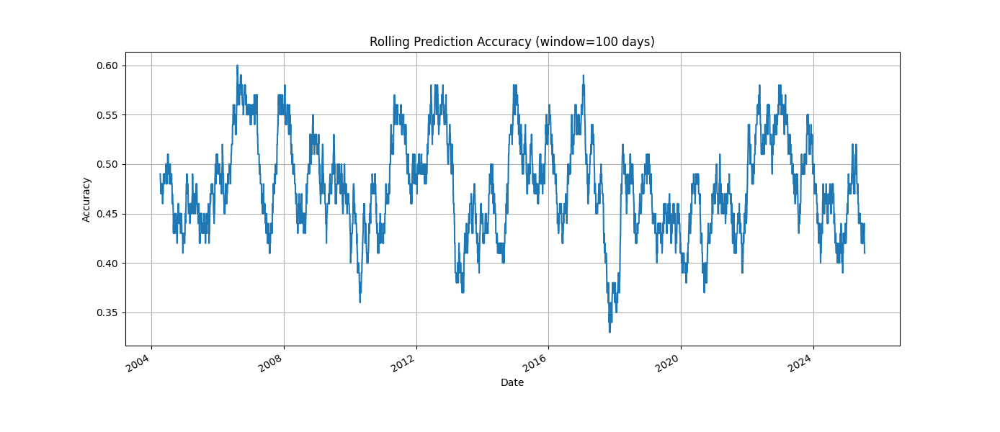

# Stock Price Predictor with Random Forest

This project predicts whether the S&P 500 index (ticker: `^GSPC`) will go up the next day using a Random Forest Classifier trained on historical data from Yahoo Finance.

## 🔍 Project Overview

- Fetches historical S&P 500 data using `yfinance`
- Adds rolling average and trend-based features
- Trains a Random Forest model to predict whether the market will go up the next day
- Performs walk-forward backtesting
- Visualizes rolling prediction accuracy

## 📈 Sample Output

 <!-- Optional: insert a sample plot here -->

## 🛠️ Requirements

Install the required Python packages:

```bash
pip install -r requirements.txt
